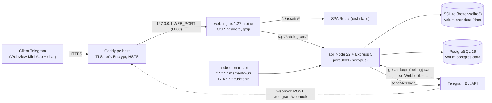
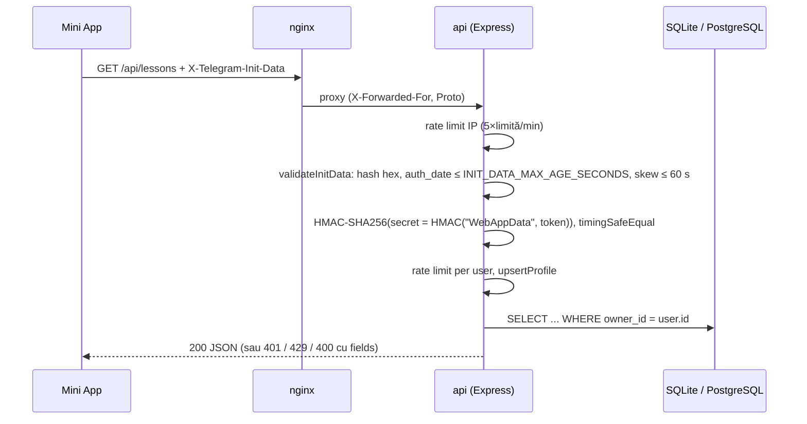

# Arhitectura Orar Univer — harta proiectului

Orar Univer este un bot Telegram cu Mini App pentru orarul universitar. Are două roluri
(Student/Profesor), săptămâni pare/impare, memento-uri în Telegram și un catalog pentru profesor
(grupe, studenți, prezență, note). Documente înrudite: [README](../README.md) ·
[backend/README](../backend/README.md) · [DEPLOY](DEPLOY.md) · [AUDIT](AUDIT.md).

## 1. Diagramă generală



Containerele (`docker-compose.yml`): `postgres` → `api` (pornește după healthcheck Postgres) →
`web` (pornește după healthcheck api). Doar `web` publică un port, legat implicit la `127.0.0.1`.
`docker-compose.dev.yml` expune suplimentar Postgres pe `127.0.0.1:55434` și API-ul pe `127.0.0.1:3001`.

## 2. Arborele de directoare

```text
.
├── docker-compose.yml        # stiva de producție: postgres, api, web; limite memorie, no-new-privileges, loguri rotite
├── docker-compose.dev.yml    # override local: porturi 55434 (Postgres) și 3001 (API) pe localhost
├── .env.example              # variabile Compose: POSTGRES_*, WEB_PORT, WEB_BIND, BACKUP_*
├── deploy/
│   ├── Caddyfile             # proxy HTTPS pe host → 127.0.0.1:8083, HSTS, health_uri /nginx-health
│   ├── deploy.sh             # verifică .env-urile, build, chown /data, up -d, așteaptă healthy
│   └── backup.sh             # pg_dump + backup SQLite online (.backup), SHA256SUMS, retenție N zile
├── backend/                  # API + bot + cron (Node 22, TypeScript, ESM)
│   ├── Dockerfile            # multi-stage node:22-alpine, tini, USER node, VOLUME /data
│   ├── .env.example          # token bot, MINI_APP_URL, polling/webhook, CORS, rate limit, SEMESTERS
│   └── src/
│       ├── index.ts          # punct de intrare: config, DB, HTTP, cron, polling/webhook, oprire grațioasă
│       ├── app.ts            # createApp(): helmet, CORS, rate limit, auth initData, toate rutele, handler erori
│       ├── config.ts         # loadConfig() cu validare (ConfigError), miniAppButton() doar pentru https
│       ├── db.ts             # SQLite: schemă, migrări, lecții/notificări, zile nelucrătoare, prune
│       ├── profile.ts        # modelul profilului și regulile de mod (resolveProfileModes, 409)
│       ├── groupSync.ts      # puntea orar ↔ catalog: groupKey, redenumire, import grupe, advisory locks
│       ├── academic.ts       # pool pg, schema catalogului (advisory lock), retry cu backoff, health
│       ├── bot.ts            # comenzi /start /azi /saptamana /rol /notificari /status; polling; setWebhook
│       ├── reminders.ts      # sendDueReminders(): rezervare înainte de trimitere, eliberare la erori tranzitorii
│       ├── schedule.ts       # ceas Europe/Chisinau, semestre (SEMESTERS), paritate, sărbători, dueReminderOccurrence()
│       ├── telegram.ts       # validare HMAC initData, secret webhook, safeEqual, client Bot API cu timeout
│       ├── rateLimit.ts      # limitator fixed-window în memorie + middleware Express (429 + Retry-After)
│       ├── validation.ts     # scheme zod: lecție, profil, grupă, student, prezență, notă, id/uuid
│       ├── labels.ts         # acordul numeralului în română („1 minut” / „20 de minute”)
│       ├── util.ts           # sleep() care se întrerupe la AbortSignal
│       └── *.test.ts         # teste vitest pentru fiecare modul de mai sus
└── frontend/                 # Mini App (React 19 + Vite 6)
    ├── Dockerfile            # build Vite → nginx:1.27-alpine, `nginx -t` la build
    ├── nginx.conf            # SPA fallback, proxy /api și /telegram către api:3001, CSP, cache
    ├── vite.config.ts        # dev server 5173, proxy /api și /telegram → 127.0.0.1:3001
    ├── index.html            # încarcă telegram-web-app.js și fontul DM Sans
    └── src/
        ├── main.tsx          # initializeTelegram() + montare <App/> și importul tuturor CSS
        ├── App.tsx           # ecranul principal: sesiune, zile, rol, următoarea oră, panouri, sincronizare
        ├── api.ts            # fetch cu X-Telegram-Init-Data, timeout 15 s, mesaje de eroare RO, mapare DTO
        ├── schedule.ts       # oglinda logicii de paritate/ceas din backend, date demo, formatare
        ├── telegram.ts       # detectSession (telegram/dev/demo/none), confirmAction, BackButton
        ├── dialogs.ts        # useDialog(): stivă de modale, Escape/BackButton, focus restaurat
        ├── labels.ts         # etichete roluri (Student/Profesor), inițiala numelui
        ├── types.ts          # Lesson (weekday 0–6, weekType odd/even/both), AppNotification, Role
        ├── components/
        │   ├── LessonCard.tsx     # card de oră în timeline + BellIcon
        │   ├── LessonEditor.tsx   # formular adăugare/editare/ștergere oră (limite = lessonSchema)
        │   ├── Panels.tsx         # NotificationPanel, CalendarPanel (grilă sloturi Lu–Sâ), ProfilePanel
        │   └── TeacherCatalog.tsx # mod „settings” (grupe, studenți) și „records” (prezență, note)
        └── *.css             # styles (bază, layout), utm (temă, role switch), icons, calendar,
                              # settings (profil, toggle), editor-position, catalog + catalog-refined,
                              # scrollbars (ascunde bara, păstrează scroll-ul)
```

## 3. Model de date

**SQLite** (`DATABASE_PATH`, implicit `/data/orar.sqlite`; WAL, `foreign_keys=ON`, `busy_timeout=5000`) —
orarul personal, critic pentru `/health`.

| Tabel | Coloane principale | Note |
|---|---|---|
| `profiles` | `telegram_id` PK, `display_name`, `role` (student/teacher), `student_enabled`, `teacher_enabled`, `reminders_enabled` | upsert la fiecare cerere autentificată și comandă bot. **Fără fus orar personal**: orarul e al universității, deci un student aflat în altă țară tot la ora Chișinăului are cursul; un fus personal ar trimite memento-urile la ora greșită. Coloana `timezone` din bazele vechi rămâne pe disc, dar nu mai e citită și nu mai apare în `GET /api/me`. |
| `lessons` | `id` PK, `owner_id`, `role`, `title`, `group_name`, `teacher_name`, `room`, `weekday` 1–7, `start_time`, `end_time`, `week_kind` odd/even/every, `reminder_minutes` (0–180, implicit 15), `notifications_enabled`, `created_at`, `updated_at` | index `(owner_id, weekday, start_time)` și parțial pe `weekday` |
| `delivered_reminders` | PK (`lesson_id`, `occurrence_key` = `YYYY-MM-DD`) | deduplicare memento-uri; curățat după 14 zile |
| `notifications` | `id` PK, `owner_id`, `kind` reminder/system, `title`, `body`, `role` (null = generală), `read_at`, `created_at` | ultimele 50 în UI; șterse după 180 zile |
| `catalog_group_sync` | `owner_id` PK, `synced_at` | proprietarii ale căror grupe au fost importate o dată în Catalogul Profesor (`groupSync.ts`) |
| `non_working_days` | `date` PK, `label`, `source` (`holiday` / `custom`) | zile fără ore: sărbători legale semănate automat + zile adăugate manual |
| `non_working_seeds` | `year` PK, `seeded_at` | anii deja semănați, ca o sărbătoare ștearsă intenționat să nu reapară |

**PostgreSQL** (`DATABASE_URL`) — Catalogul Profesor, opțional (fără el, rutele `/api/teacher/*` răspund 503).
Schema e creată idempotent de `academic.ts` sub `pg_advisory_xact_lock`.

| Tabel | Coloane principale | Constrângeri |
|---|---|---|
| `academic_groups` | `id` UUID, `owner_id` BIGINT (Telegram id), `name`, `subject`, `created_at` | `UNIQUE(owner_id, name)` |
| `students` | `id` UUID, `group_id` → grupă, `first_name`, `last_name` | `ON DELETE CASCADE` |
| `attendance_sessions` | `id` UUID, `group_id`, `occurred_on` DATE, `topic` | `UNIQUE(group_id, occurred_on)` |
| `attendance_entries` | PK(`session_id`, `student_id`), `status` | `CHECK status IN (present, absent, late)` |
| `lab_grades` | `id` UUID, `student_id`, `laboratory`, `grade` NUMERIC(4,2), `presented_on`, `feedback` | `CHECK 0 ≤ grade ≤ 10` |

## 4. Fluxuri cheie



- **Autentificare.** Fiecare rută `/api/*` (în afară de `/api/health`) cere header-ul
  `X-Telegram-Init-Data`. `ALLOW_DEV_AUTH=true` acceptă `X-Dev-Telegram-Id`, dar config-ul îl refuză când
  `NODE_ENV=production`. Frontend-ul trimite initData doar dacă e semnat (`detectSession`).
- **CRUD lecții.** zod validează corpul (`endTime > startTime`, fără caractere de control). `POST` are limită
  de 500 de ore per utilizator. `PUT`/`DELETE` folosesc `WHERE id=? AND owner_id=?`, deci o oră străină dă
  404, nu 403. `DELETE` șterge în aceeași tranzacție și rândurile din `delivered_reminders`.
- **Memento-uri.** Cron `* * * * *` cu `timezone: Europe/Chisinau`, fără rulări suprapuse (`reminderRunning`).
  1. Selectează lecțiile de ieri, azi și mâine cu `notifications_enabled=1`, cu `profiles.reminders_enabled=1`
     (comanda de bot `/notificari off`) și cu modul rolului lecției activ în profil.
  2. `dueReminderOccurrence()` verifică paritatea săptămânii pentru data ocurenței. Memento-ul e datorat
     când `0 ≤ reminderMinutes − minutesUntilStart ≤ max(5, reminderMinutes)` **și** ora nu a început cu
     mai mult de 5 minute în urmă. Adică: cât timp ora nu a început, memento-ul se poate recupera pentru
     o durată egală cu propriul avans (un restart, un deploy sau ora lipsă de la trecerea la ora de vară
     înghit minute întregi, dar „În 6 minute” tot e util); după ce ora a început mai rămân doar cele
     5 minute de grație, deci niciun memento nu pleacă vreodată mai târziu de atât — inclusiv cel cu
     `reminderMinutes = 0` („A început acum N min”). Poate trece de miezul nopții.
  2b. Zilele fără ore sunt sărite: sărbătorile legale și zilele marcate manual (`non_working_days`), plus
     orice dată din afara semestrelor (`isTeachingDay`). **Orele rămân vizibile în orar — tace doar
     memento-ul.**
  3. Record-before-send: `INSERT OR IGNORE` în `delivered_reminders`, iar mesajul pleacă doar dacă inserarea
     a reușit. La eroare tranzitorie rezervarea e eliberată. La 400/403 (chat blocat) rămâne, fără retry.
  4. După trimitere se scrie o notificare `reminder`. Cron-ul `17 4 * * *` curăță datele vechi.
- **Catalog profesor.** Toate rutele `/api/teacher/*` cer **modul Profesor activ** în profil
  (`teacherEnabled`), altfel 403 — regula e impusă pe server, nu doar în interfață. Accesul se verifică
  apoi prin `owner_id` la fiecare interogare. UUID-urile invalide dau 404. Legătura oră ↔ grupă e
  calculată pe nume (`groupKey` = text normalizat, fără majuscule), niciodată stocată — de aceea `PATCH`
  pe o grupă **redenumește grupa și în orarul de Profesor al proprietarului** (`renameLessonGroup`, în
  aceeași tranzacție PostgreSQL, chiar înainte de COMMIT). Ștergerea unei grupe nu șterge nicio oră.
  Limite: 200 de grupe per profesor și 500 de studenți per grupă. Prezența se salvează într-o tranzacție:
  upsert pe sesiunea zilei, apoi upsert pe intrări prin `unnest ... JOIN students` al grupei. Dacă un student
  nu aparține grupei, se face rollback cu 400. Nota se inserează doar dacă studentul aparține unei grupe a
  profesorului. Erorile Postgres sunt mapate: `23505`→409, `23503`→404, `22P02/22003/23514`→400.
- **Bot.** Răspunde doar în chat privat, la mesaje care încep cu `/`, cu datele cheiate după `from.id`.
  Comenzi: `/start`, `/help`, `/azi`, `/saptamana`, `/rol student|profesor`, `/notificari on|off`
  (comută toate lecțiile utilizatorului), `/status`. Există două moduri de primire, exclusive:
  - polling: `deleteWebhook`, apoi `getUpdates` long-poll de 25 s, cu backoff (409 → 30 s, 401/404 → 5 min);
  - webhook: `setWebhook` cu `secret_token` și retry în fundal; `POST /telegram/webhook` răspunde mereu
    200 după ce secretul e verificat, ca Telegram să nu retrimită update-ul.

## 5. Semestre, paritate și zile nelucrătoare

Calendarul academic se configurează din mediu, prin variabila **`SEMESTERS`** (`backend/src/config.ts`,
validată la pornire; regulile de calcul sunt în `backend/src/schedule.ts`).

```ini
# START:even|odd[:END], separate prin virgulă
SEMESTERS=2026-09-07:even:2026-12-20,2027-02-01:even:2027-05-30
```

Reguli, toate impuse de `parseSemesters` (o valoare greșită oprește API-ul la pornire, cu lista
completă a problemelor într-un singur `ConfigError`):

- `START` trebuie să fie **luni** — prima luni a semestrului — și dă paritatea acelei prime săptămâni.
- `END` este **inclusiv** și poate lipsi **doar la ultima intrare**: un semestru fără sfârșit înghite tot
  ce urmează, deci ar suprapune semestrul următor.
- Semestrele nu se pot suprapune; sunt sortate automat după `START`.
- O valoare **goală păstrează exact comportamentul dinainte**: un singur semestru fără sfârșit, început
  la `2026-09-07`, săptămână pară (`DEFAULT_SEMESTERS`).

Calculul:

- `universityWeekNumber = round((lunea(dată) − lunea(START)) / 7 zile) + 1`. Săptămâna 1 e prima
  săptămână a semestrului; săptămânile dinaintea începutului au numerele 0, −1, …
- **Paritatea repornește la fiecare semestru:** numerele impare (…, −1, 1, 3, …) au paritatea primei
  săptămâni a semestrului, cele pare o au pe cealaltă. Asta e diferența față de vechea ancoră unică
  hardcodată, unde un contor care curgea continuu lăsa vacanța de iarnă să consume paritate și putea
  inversa semestrul II.
- **În afara oricărui semestru** numărul și paritatea rămân definite — calendarul trebuie să afișeze ceva
  și în vacanță — prin prelungirea ultimului semestru deja început (sau a primului, pentru date de
  dinaintea anului universitar). Doar `isTeachingDay` spune dacă se țin ore.
- Datele se calculează la prânz UTC (`T12:00:00Z`), așa că trecerea la ora de vară nu schimbă ziua.
  Ceasul curent vine din `Intl.DateTimeFormat` cu `timeZone: Europe/Chisinau`, indiferent de fusul orar
  al dispozitivului.

**`GET /api/week?date=` este singura sursă de adevăr** pentru numerotare și paritate și întoarce
`date`, `number`, `kind`, `inSemester`, `semesterStart`, `semesterEnd`, lista completă `semesters` și
`nonWorkingDays` — zilele nelucrătoare ale întregii săptămâni afișate (luni→duminică), nu doar ale datei
cerute. Câmpurile `referenceMonday` / `referenceKind` sunt păstrate **doar ca depreciate**, pentru
clienții publicați înainte de semestre.

Frontend-ul oglindește modelul (`frontend/src/schedule.ts`: `Semester`, `semesterAnchorOf`,
`universityWeekNumber`, `weekTypeFor`) și **instalează lista primită de la `/api/week`** prin
`installSemesters`, care validează fiecare intrare și, dacă lista e goală sau nefolosibilă, revine la
`DEFAULT_SEMESTERS`. Acel default local e identic cu cel din backend, ca aplicația să aibă o paritate
și în modul demo, și în secundele dinaintea primului răspuns, fără să pâlpâie. O ancoră hardcodată,
care nu s-ar actualiza din răspuns, ar fi greșită de îndată ce există mai mult de un semestru.

**Zile nelucrătoare.** `db.ts` semănează automat sărbătorile legale ale Republicii Moldova pentru anul
curent și pentru următorul, în `non_working_days` (`source='holiday'`), o singură dată per an — anul
semănat se notează în `non_working_seeds`, deci o sărbătoare ștearsă intenționat nu reapare. Pe lângă
cele cu dată fixă, sunt derivate și cele mobile din Paștele ortodox calculat cu algoritmul lui Meeus
(`orthodoxEaster`): Paștele, a doua zi de Paște și Paștele Blajinilor. Zilele adăugate manual
(`setNonWorkingDay`) au `source='custom'`. Perioadele dintre semestre **nu** sunt enumerate aici — rezultă
din modelul de semestru, ca nimeni să nu fie nevoit să scrie vacanța de vară zi cu zi.
Efect: **orele rămân vizibile, tac doar memento-urile.**

- Convenții diferite pentru zi: backend și DB folosesc `weekday` 1–7 (Lu=1), UI folosește 0–6 (Lu=0),
  iar `api.ts` face conversia. Tot acolo `every` din backend devine `both` în UI.

## 6. Securitate pe straturi

| Strat | Măsuri |
|---|---|
| Caddy (host) | TLS automat, HSTS 1 an, elimină `Server`; singurul punct public (80/443) |
| nginx (`web`) | CSP strictă pentru SPA (script doar `self` + telegram.org, `frame-ancestors` telegram), `nosniff`, `Referrer-Policy`, `Permissions-Policy`, `server_tokens off`, `client_max_body_size 1m`, fișiere ascunse → 404, real IP doar din rețele private |
| Express (`api`) | `helmet`, `x-powered-by` dezactivat, `trust proxy` doar loopback/private, CORS doar pe `ALLOWED_ORIGINS`, JSON ≤ 64 kb, rate limit pe IP și pe utilizator (in-memory, o singură instanță), erori fără stack trace |
| Date | zod pe toate intrările, SQL parametrizat (better-sqlite3 / `$1`), izolare prin `owner_id`, `CHECK`/`UNIQUE` în Postgres |
| Telegram | HMAC initData cu expirare (`INIT_DATA_MAX_AGE_SECONDS`, implicit **1 oră**: e o credențială de tip bearer, fără revocare), secret webhook comparat în timp constant, bot doar în chat privat |
| Containere | `USER node` + tini (api), `no-new-privileges`, limite de memorie, Postgres și api fără porturi publicate, `web` legat la 127.0.0.1 |
| Operare | `deploy.sh` refuză `ALLOW_DEV_AUTH=true`, parolă implicită sau `MINI_APP_URL` non-https; `chmod 600` pe `.env`; backup-uri cu `umask 077` |

## 7. Endpoints

Detalii despre corpuri, coduri și exemple: [backend/README.md](../backend/README.md).

| Metodă | Rută | Auth | Rol |
|---|---|---|---|
| GET | `/health`, `/api/health` | — | stare SQLite (critic) + Postgres (`ok`/`degraded`) |
| GET / PATCH | `/api/me` | initData | profil; schimbare rol, `studentEnabled`, `teacherEnabled` |
| GET | `/api/week?date=YYYY-MM-DD` | initData | săptămâna: număr, paritate, semestrul curent, lista semestrelor și zilele nelucrătoare ale săptămânii |
| GET | `/api/non-working-days?from=&to=` | initData | zilele nelucrătoare dintr-un interval (max. 400 de zile); doar citire |
| GET / POST | `/api/lessons` | initData | listă / creare oră |
| PUT / DELETE | `/api/lessons/:id` | initData + proprietar | modificare / ștergere oră |
| GET | `/api/notifications` | initData | ultimele 50 de notificări |
| PATCH | `/api/notifications/read` | initData | marchează ca citite (opțional doar pentru un rol) |
| GET / POST | `/api/teacher/groups` | initData + mod Profesor | grupele profesorului / grupă nouă |
| PATCH / DELETE | `/api/teacher/groups/:groupId` | initData + mod Profesor + proprietar | redenumire (**se propagă în orar**) / ștergere |
| GET / POST | `/api/teacher/groups/:groupId/students` | initData + mod Profesor + proprietar | studenți / student nou |
| PATCH / DELETE | `/api/teacher/students/:studentId` | initData + mod Profesor + proprietar | modificare / ștergere student |
| GET / POST | `/api/teacher/groups/:groupId/attendance` | initData + mod Profesor + proprietar | prezența pe o dată (citire / upsert) |
| GET / POST | `/api/teacher/students/:studentId/grades` | initData + mod Profesor + proprietar | note de laborator (citire / upsert pe laborator) |
| POST | `/telegram/webhook` | secret header | update-uri bot (doar în modul webhook) |

Tot ce e sub `/api/teacher/` cere **modul Profesor activ** în profil; fără el răspunsul e 403, indiferent
de proprietate. Nu există rută de scriere pentru zilele nelucrătoare: aplicația nu are model de
administrator (orice utilizator autentificat primește ambele moduri), iar o zi nelucrătoare e
instituțională — ar amuți memento-urile *tuturor*. Până când există un rol de administrator real,
adăugarea și ștergerea lor rămân operații pe server (`setNonWorkingDay` / `removeNonWorkingDay` din `db.ts`).
